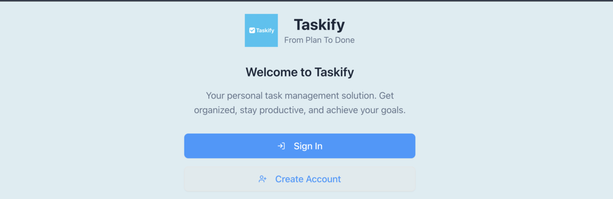

# Taskify - Modern Task Management App

<div align="center">
  
  
  <h3>A powerful, intuitive task management application built with Next.js 15 and Supabase</h3>
  
  
</div>

## ✨ Features

- **🔐 Secure Authentication** - User registration and login with Supabase Auth
- **📋 Task Management** - Create, edit, delete, and organize tasks
- **📁 Project Organization** - Group tasks into projects for better organization
- **📅 Date-based Views** - Today's tasks, upcoming deadlines, and custom date filters
- **🔍 Smart Search** - Find tasks and projects quickly with intelligent search
- **🎨 Modern UI** - Clean, responsive design with dark/light theme support
- **📱 Mobile Responsive** - Works seamlessly across all devices
- **⚡ Real-time Sync** - Instant updates across all your devices

## 🚀 Tech Stack

- **Frontend**: Next.js 15, React 19, TypeScript
- **Backend**: Supabase (Authentication, Database, Real-time)
- **UI Components**: shadcn/ui, Radix UI
- **Styling**: Tailwind CSS
- **Forms**: React Hook Form with Zod validation
- **Icons**: Lucide React
- **Date Handling**: date-fns

## 📋 Prerequisites

Before you begin, ensure you have the following installed:
- Node.js 18+ 
- npm or yarn
- A Supabase account and project

## 🛠️ Installation

1. **Clone the repository**
   ```bash
   git clone https://github.com/Manisha-batesar/taskify-todo-app.git
   cd taskify-todo-app
   ```

2. **Install dependencies**
   ```bash
   npm install
   ```

3. **Set up environment variables**
   ```bash
   cp .env.example .env.local
   ```
   
   Fill in your Supabase credentials in `.env.local`:
   ```env
   NEXT_PUBLIC_SUPABASE_URL=your_supabase_project_url
   NEXT_PUBLIC_SUPABASE_ANON_KEY=your_supabase_anon_key
   NEXT_PUBLIC_SITE_URL=http://localhost:3000
   ```

4. **Set up the database**
   
   Run the SQL scripts in your Supabase SQL editor:
   - Execute `schema.sql` to create the database tables
   - Execute `supabase-policies.sql` to set up Row Level Security policies

5. **Start the development server**
   ```bash
   npm run dev
   ```

6. **Open your browser**
   
   Navigate to [http://localhost:3000](http://localhost:3000)

## 🏗️ Project Structure

```
taskify-todo-app/
├── app/                    # Next.js 15 App Router
│   ├── (auth)/            # Authentication routes
│   ├── (protected)/       # Protected dashboard routes
│   └── api/               # API routes
├── components/            # React components
│   ├── auth/             # Authentication components
│   ├── layout/           # Layout components
│   ├── projects/         # Project management components
│   ├── tasks/            # Task management components
│   └── ui/               # shadcn/ui components
├── context/              # React Context providers
├── lib/                  # Utility functions and database operations
├── types/                # TypeScript type definitions
├── public/               # Static assets
└── styles/               # Global styles
```

## 🔧 Configuration

### Supabase Setup

1. Create a new Supabase project at [supabase.com](https://supabase.com)
2. Get your project URL and anon key from the project settings
3. Run the database migration scripts provided in the repository
4. Enable Row Level Security policies for data protection

### Environment Variables

| Variable | Description | Required |
|----------|-------------|----------|
| `NEXT_PUBLIC_SUPABASE_URL` | Your Supabase project URL | ✅ |
| `NEXT_PUBLIC_SUPABASE_ANON_KEY` | Your Supabase anonymous key | ✅ |
| `NEXT_PUBLIC_SITE_URL` | Your site URL for production | ✅ |

## 📱 Usage

### Getting Started

1. **Sign up** for a new account or **sign in** with existing credentials
2. **Create your first project** to organize your tasks
3. **Add tasks** with descriptions, due dates, and priority levels
4. **Navigate** between different views:
   - **Today**: Tasks due today
   - **Projects**: Tasks organized by project
   - **Inbox**: All unorganized tasks
   - **Search**: Find specific tasks or projects

### Key Features

- **Task Management**: Add, edit, complete, and delete tasks
- **Project Organization**: Create projects and assign tasks to them
- **Date-based Filtering**: View tasks by due date
- **Search Functionality**: Quickly find tasks and projects
- **Responsive Design**: Use on desktop, tablet, or mobile

## 🤝 Contributing

We welcome contributions! Please follow these steps:

1. Fork the repository
2. Create a feature branch (`git checkout -b feature/amazing-feature`)
3. Commit your changes (`git commit -m 'Add some amazing feature'`)
4. Push to the branch (`git push origin feature/amazing-feature`)
5. Open a Pull Request

## 📄 License

This project is licensed under the MIT License - see the [LICENSE](LICENSE) file for details.

## 🐛 Issues

If you encounter any issues or have suggestions, please [open an issue](https://github.com/Manisha-batesar/taskify-todo-app/issues) on GitHub.

## 👨‍💻 Author

**Manisha Batesar**
- Twitter: [@Manishabatesar](https://twitter.com/Manishabatesar)
- GitHub: [@Manisha-batesar](https://github.com/Manisha-batesar)

## 🙏 Acknowledgments

- [Next.js](https://nextjs.org/) for the amazing React framework
- [Supabase](https://supabase.com/) for the backend infrastructure
- [shadcn/ui](https://ui.shadcn.com/) for the beautiful UI components
- [Tailwind CSS](https://tailwindcss.com/) for the utility-first CSS framework

---

<div align="center">
  <p>Made with ❤️ by <a href="https://github.com/Manisha-batesar">Manisha Batesar</a></p>
</div>
